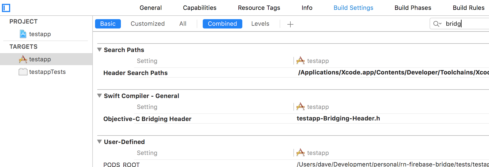

# React Native Firebase Bridge

A bridge to the native Firebase SDK's for iOS and Android.

iOS and Android SDK support offline mode's which the node / web SDK does not.

# Installation

```
npm install --save rn-firebase-bridge
react-native link
```

## iOS

In [Firebase console](https://console.firebase.google.com/) follow the instructions for adding iOS to your project.

Your Podfile should have at least:

```
pod 'Firebase'
pod 'Firebase/Database'
pod 'Firebase/Auth'
```

Open the Xcode project, right click on `Libraries` and click `Add Files to
"MyApp"`. Navigate to `node_modules/rn-firebase-bridge` and click the `ios`
directory. You may wish to rename it to something more obvious (ie. `FirebaseBridge`).

You will also need to create a Swift bridging header. To do this add a new header
file to your project (eg. `yourapp-Bridging-Header.h`) and make sure it contains the following:

```
#import "RCTBridge.h"
#import "../node_modules/rn-firebase-bridge/ios/FirebaseBridge.h"
```

Under your Build Settings set the `Objective-C Bridging Header` to the file your just created:



Also make sure your `Other linker flags` setting under `Build Settings` includes
`$(inherited)`.

## Android

In your firebase console follow the instructions for adding Android to your project.

# Getting started

Interfacing with the native SDK all happens asynchronously so the examples below
will make extensive use of await and assumes the examples run within a function
marked as async:

```
async componentDidMount() {
  const user = firebase.auth().signInAnonymously();
  this.setState({ user });
}
```

To start with import firebase and get a reference to your default app:

```
import firebase from 'rn-firebase-bridge';

// Get default app
const app = firebase.initializeDefaultApp();

// Or initialize another app with options
const app = firebase.initializeApp(options);
```

From this you can access different services:

```
const database = app.database();
const auth = app.auth();
```

Alternatively you can access the default app services directly:

```
// This is equivalent to calling the same functions on the default app
const database = firebase.database();
const auth = firebase.auth();
```

# API

## Types

### EventType

One of `value`, `child_added`, `child_removed`, `child_changed`, `child_moved`

The events are fired for database `on` and `once` listeners.

### Priority

string | number | null

## Auth

Get auth instance from your app:

```
import firebase from 'rn-firebase-bridge';

const app = firebase.initializeApp(options);
const auth = app.auth();

// Shortcut to get auth for default app

const auth = firebase.auth();
```

### Possible error codes

You can check the code on a error against the list below:

```
try {
  await firebase.auth().signInWithEmail('test@example.com', 'wrong-password');
} catch (e) {
  if (e.code === 'auth/weak-password') {
    // ... do something
  }
}
```

Android SDK provides a smaller number of known error codes.

#### iOS / Android:

```
auth/weak-password
auth/requires-recent-login
auth/email-already-in-use
auth/user-disabled
auth/user-not-found
auth/invalid-email
auth/wrong-password
```

#### iOS

```
auth/app-not-authorized
auth/credential-already-in-use
auth/invalid-custom-token
auth/custom-token-mismatch
auth/email-already-in-use
auth/invalid-api-key
auth/invalid-credential
auth/invalid-user-token
auth/network-request-failed
auth/account-exists-with-different-credential
auth/too-many-requests
auth/operation-not-allowed
auth/user-token-expired
auth/internal-error
auth/user-mismatch
auth/keychain-error
auth/provider-already-linked
auth/no-such-provider
```

### User

Current user can be obtained from the auth instance:

```
const user = auth.currentUser;
```

You can also get passed a `User` instance if you register a `onAuthStateChanged` listener (see below).

```
auth.onAuthStateChanged(user => {
  if (user) {
    console.log(`User ${user.uid} is logged in`);
  } else {
    console.log('Not logged in');
  }
})
```

#### Properties

```
uid: string;
email: ?string;
emailVerified: boolean;
providerId: string;
displayName: ?string;
photoUrl: ?string;
isAnonymous: boolean;
```

#### Methods

`delete() : Promise<void>`

Deletes the user. Promise resolves with no value when completed.

`getToken(forceRefresh = false) : Promise<string>`

Fetch a token for a user, optionally forcing a refresh even if the token
hasn't expired. Promise resolves the token.

`link(credential) : Promise<User>`

Link a credential to a user. Resolves with `User` instance on completion.

`reauthenticate(credential) : Promise<void>`

Re-authenticate user with a credential. Resolves with no value on completion.

`reload() : Promise<void>`

Reload user details. Resolves with no value on completion.

`sendEmailVerification() : Promise<void>`

Send a email verification to user. Resolves with no value on completion.

`unlink(providerId:string) : Promise<void>`

Unlink specified provider from user. Resolves with no value on completion.

`updateEmail(newEmail:string) : Promise<void>`

Update user email. Promise resolves with no value on completion.

`updatePassword(newPassword:string) : Promise<void>`

Update user password. Promise resolves with no value on completion.

`updateProfile(profile:{|displayName?:string, photoURL?:string|}) : Promise<void>`

Update user profile. Accepts an object with one, or both, of `displayName` and `photoURL`.
Promise resolves with no value on completion.

### currentUser

Current user, if any.

```
const user = firebase.auth().currentUser;
```

### createUserWithEmail(email:string, password:string) : Promise<User>

```
async createUser(email, password) {
  try {
    const user = await firebase.auth().createUserWithEmailAndPassword(email, password);
    user.sendEmailVerification();
    this.setState({ user });
  } catch (error) {
    // See below for potential values of error.code
  }
}
```

Possible error codes:

`auth/email-already-in-use`

`auth/invalid-email`

`auth/operation-not-allowed`

Thrown if email/password accounts are not enabled. Enable email/password accounts in the Firebase Console, under the Auth tab.

`auth/weak-password`

### signInWithEmail(email:string, password:string) : Promise<User>

```
async signInWithEmail(email, password) {
  try {
    const user = await firebase.auth().signInWithEmail(email, password);
    user.sendEmailVerification();
    this.setState({ user });
  } catch (error) {
    // See below for potential values of error.code
  }
}
```

Possible error codes:

`auth/invalid-email`

`auth/user-disabled`

`auth/user-not-found`

`auth/wrong-password`

### signInWithCredential(credential:AuthCredential) : Promise<User>

Sign in with a credential. Create credential from one of the available providers:

`firebase.auth.GithubAuthProvider`

`firebase.auth.FacebookAuthProvider`

`firebase.auth.TwitterAuthProvider`

`firebase.auth.GoogleAuthProvider`

```
async signInWithGithub(token) {
  const credential = firebase.auth.GithubAuthProvider.credential(token);
  try {
    await this.props.app.auth().signInWithCredential(credential);
  } catch (error) {
    // See below of potential values of error.code
  }
}
```

Potential error codes:

`auth/account-exists-with-different-credential`

`auth/operation-not-allowed`

`auth/user-disabled`

`auth/user-not-found`

`auth/wrong-password`

### signInAnonymously() : Promise<User>

```
async signInAnonymously() {
  try {
    const user = await firebase.auth().signInAnonymously();
    this.setState({ user });
  } catch (error) {
    // See below for potential values of error.code
  }
}
```

Potential error codes:

`auth/operation-not-allowed`

Thrown if anonymous accounts are not enabled. Enable anonymous accounts in the Firebase Console, under the Auth tab.

### signOut() : Promise<null>

Sign user out.

```
async signOut() {
  await firebase.auth().signOut();
  console.log('User has been signed out');
}
```

### onAuthStateChanged(callback:(User:?user) -> void)

Add a listener on auth state changes. If user is logged in parameter to callback
will be a `User` instance, otherwise null.

```
firebase.auth().onAuthStateChanged(user => {
  if (user) {
    console.log(`User ${user.uid} is logged in`);
  } else {
    console.log('Not logged in');
  }
});
```

### FacebookAuthProvider

Sign in using Facebook. You must get the token using the Facebook SDK.

```
async signInWithFacebook(token) {
  try {
    const credential = firebase.auth.FacebookAuthProvider.credential(token);
    const user = firebase.auth().signInWithCredential(credential);
    this.setState({ user });
  } catch (e) {
    // See signInWithCredential above for possible error codes
  }
}
```

### TwitterAuthProvider

Sign in using Twitter.

```
async signInWithTwitter(token, secret) {
  try {
    const credential = firebase.auth.TwitterAuthProvider.credential(token, secret);
    const user = firebase.auth().signInWithCredential(credential);
    this.setState({ user });
  } catch (e) {
    // See signInWithCredential above for possible error codes
  }
}
```

### GithubAuthProvider

Sign in using Github.

```
async signInWithGithub(token) {
  try {
    const credential = firebase.auth.GithubAuthProvider.credential(token);
    const user = firebase.auth().signInWithCredential(credential);
    this.setState({ user });
  } catch (e) {
    // See signInWithCredential above for possible error codes
  }
}
```

### GoogleAuthProvider

Sign in using Google.

```
async signInWithGoogle(idToken, accessToken) {
  try {
    const credential = firebase.auth.GoogleAuthProvider.credential(idToken, accessToken);
    const user = firebase.auth().signInWithCredential(credential);
    this.setState({ user });
  } catch (e) {
    // See signInWithCredential above for possible error codes
  }
}
```

## Database

### Database class

```
import firebase from 'firebase';

// Get instance
const database = firebase.database();

// Access static methods
firebase.database.sdkVersion()
firebase.database.enableLogging(true);
```

#### Properties:

`ServerValue` - TODO: not yet implemented

Static methods:

`enableLogging(enabled:boolean)`

Enable / disable logging.

`sdkVersion()`

Get version of SDK.

Methods:

`goOnline()`

(Re)connect to the server and synchronize the offline database state with the server state.

`goOffline()`

Disconnect from the server.

`setPersistenceEnabled(enabled:boolean)`

Set true to enable disk persistence, set false to disable it.

`ref(path?:string) : DatabaseReference`

Return a reference to the root or the specified path

`refFromURL(url) : DatabaseReference`

Return a reference to the root or the path specified in the URL.

### Query

#### endAt(value:number|string|boolean|null, key:?string) : Query
#### equalTo(value:number|string|boolean|null, key:?string) : Query
#### limitToFirst(limit:number) : Query
#### limitToLast(limit:number) : Query
#### on(eventType:EventType, cb:((snapshot:DataSnapshot) => Promise)) : () => void

Listen for a change event. Returns a function to remove the listener.

Because fetching a snapshot is asynchronous and then any further actions on that
snapshot are also asynchronous (including fetching it's children, which are
also snapshots) we have to cache the snapshots on the native side to allow further
queries. We don't want to cache them forever, just until the consumer is done with it
but without relying on manual release. The callback must return a promise which,
when it resolves or rejects, causes the snapshot to be released on the native side.
Because of async/await this isn't too onerous:

```
ref.on('value', async (snapshot) => {
    await snapshot.forEach(async (child) => {
        console.log('Child value:', async child.val());
    })
    console.log('Value is': await snapshot.val());
});
```

#### once(eventType:EventType, cb:((snapshot:DataSnapshot) => Promise)) : () => void
#### orderByChild(path:string) : Query
#### orderByKey() : Query
#### orderByPriority() : Query
#### orderByValue() : Query
#### startAt(value:number|string|boolean|null, key:?string) : Query
#### toString() : Promise<string>
Resolves to full URL for this location.

### DatabaseReference

Extends `Query`.

```
import firebase from 'rn-firebase-bridge';

const ref = firebase.database().ref();
```

#### child(path:string) : DatabaseReference

Create a child at specified path. Can be chained.

```
import firebase from 'rn-firebase-bridge';

const item = firebase.database().ref().child('shop').child('packages').push().child('items').push();
```

#### push() : DatabaseReference

Push a new item onto a list.

#### setValue(value:any) : Promise

Set value and return a promise that resolves when complete. Will reject on failure.

#### setValueWithPriority(value:any, priority:Priority) : Promise

As above but set value with priority.

#### remove() : Promise

Remove value with a promise that resolves on completion.

#### setPriority(priority:Priority) : Promise

Set priority and return a promise that resolves when complete. Will reject on failure.

### DataSnapshot

Whenever a listener is called for a data event a `DataSnapshot` is passed.

#### child(path: string) : DataSnapshot
#### exists() : Promise<boolean>
#### exportVal() : Promise<any>
#### hasChild(path:string) : Promise<boolean>
#### hasChildren() : Promise<boolean>
#### numChildren() : Promise<number>
#### val() : Promise<any>
#### forEach(cb:(snapshot:DataSnapshot) => Promise) : Promise

As with `DatabaseReference.on` the callback should return a promise to indicate
the snapshot is no longer needed. If your promise returns true then no further
iteration will occur.

```
snapshot.forEach(async (child) => {
    const value = await child.val();
    if (value === "abc") {
        // Cancel enumeration
        return true;
    }
});
```
#### getPriority() : Promise<Priority>
